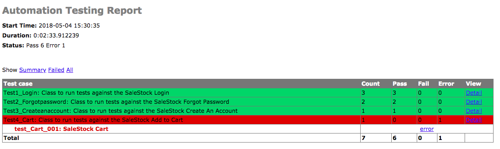

### Automation Test SaleStock app

### Requrements
- EasyProcess==0.2.3
- PyVirtualDisplay==0.2.1
- selenium==3.9.0

### OS
- macOS High Sierra 10.13.3
- Ubuntu Server 16.04.3 64

#### Note :
- browser = HEADLESS / VM / Default: Chrome
- Test Report = report.html (HTMLTestRunner)

### Chrome Driver
- directory "../driver"
- download https://sites.google.com/a/chromium.org/chromedriver/downloads

### How to use
1. Download chromedriver
2. Buat directory driver diluar directory project "../driver"
3. Masukkan chromedriver ke dalam folder tersebut
4. Install pip python $ sudo easy_install pip
5. Install virtualenv $ sudo pip install virtualenv
6. Buat virtualenv folder $ virtualenv venv
7. Aktifkan env $ source venv/bin/activate
8. Install requirements $ pip install -r requirements.txt
9. Run project $ python automationpractice.py damar@mailinator.com 123qwe http://automationpractice.com Chrome > report.html

### Arguments
- $: python automationpractice.py [email] [password] [url] [browser] > report.html
- EX$: python automationpractice.py damar@mailinator.com 123qwe http://automationpractice.com Chrome > report.html

### GIF

### Report HTML

- File report.html https://github.com/damarmustikoaji/automationpractice-AJobthing/blob/master/report.html
